# Phân tích định tính: tốt/xấu theo 5 nhóm lỗi

**Cách sinh dữ liệu cho file này (đọc trước khi xem tiếp).** Môi trường chạy việc
này không có trình duyệt / Playwright khả dụng, nên các hình dưới đây **không
phải screenshot của frontend đang chạy**. Chúng là ảnh ghép (composed grid) do
`scripts/generate_qualitative_figures.py` tạo ra bằng cách gọi thật
`POST /search/text` trên API đang chạy (`python tasks.py serve`, không gian
`clip-b32`, `k=10`, `exact=true`), tải thật từng thumbnail qua
`GET /thumbs/{file_name}`, rồi ghép bằng Pillow — mỗi ô có rank và score thật
từ response. Mỗi ảnh `results/figures/<tên>.png` đi kèm một file
`results/figures/<tên>.json` chứa nguyên văn response JSON của lần gọi đó, nên
mọi con số "đúng ý X/10" dưới đây truy được về đúng file JSON tương ứng, không
gõ từ trí nhớ.

**Cách đếm "đúng ý".** Với mỗi trong 10 kết quả, tôi đọc `captions` (5 câu
caption người viết) và `categories` (nhãn COCO thật) trong file JSON tương ứng,
rồi tự phán đoán ảnh đó có khớp đúng ý query hay không. Một lưu ý về giới hạn
của chính cách đếm này: caption không nhắc tới một thuộc tính (vd "bằng gỗ")
không có nghĩa ảnh chắc chắn không có thuộc tính đó — người viết caption không
bắt buộc mô tả hết mọi chi tiết. Tôi đếm theo hướng bảo thủ (chỉ tính là đúng
khi có bằng chứng xác nhận trong caption/category), nên các con số dưới đây là
**cận dưới** của độ chính xác thật, đặc biệt với các query có thuộc tính phụ.

---

## Nhóm 1 — Đếm số lượng

### "three dogs"

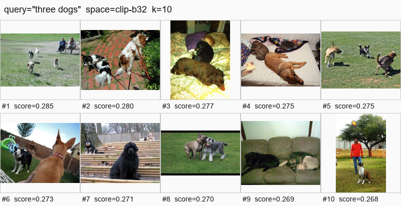

Đúng ý: **2/10** (`figures/bad_count_three_dogs.json`). Cả 10 ảnh đều có chó
thật (category `dog` xuất hiện ở mọi kết quả), nhưng số lượng chó trong caption
dao động từ 1 đến 5+ (rank 2, 3, 4, 6, 8, 9: "two dogs"; rank 10: một con duy
nhất; chỉ rank 5 và rank 7 có đa số caption xác nhận đúng ba con). CLIP học
bằng contrastive trên cặp ảnh-caption toàn cục, không có tín hiệu nào buộc nó
phân biệt "three dogs" với "two dogs" hay "a pack of dogs" — các câu đó gần
như cùng một vùng vector "nhiều chó, ngoài trời, cỏ xanh". Đây là giới hạn của
phương pháp, không phải lỗi cài đặt.

### "exactly two people sitting"

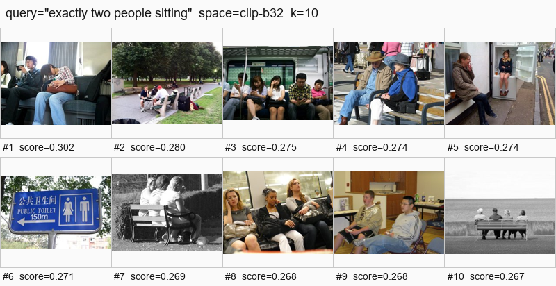

Đúng ý: **2/10** (`figures/bad_count_two_people.json`) — chỉ rank 4 ("Two men
sitting next to each other on a wooden bench", nhất quán ở cả 4/5 caption) và
rank 9 ("two people... playing video games", nhất quán ở cả 5/5 caption) thực
sự có đúng hai người đang ngồi. Các rank còn lại lệch số đông hơn (rank 2: bốn
người; rank 3: năm-sáu người; rank 7, 8: ba phụ nữ; rank 10: bốn người cao
tuổi) hoặc mâu thuẫn giữa các caption về số lượng (rank 1, 5). Chữ "exactly"
hoàn toàn bị bỏ qua — encoder không có cơ chế đếm, nó chỉ nhận diện được cảnh
"người + ngồi" nói chung.

## Nhóm 2 — Phủ định

### "a street with no cars"

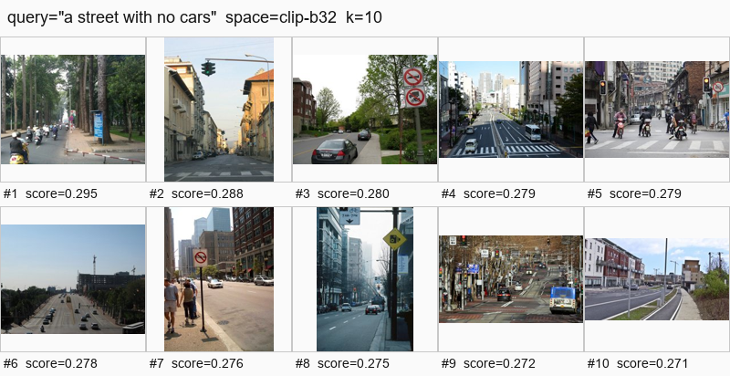

Đúng ý: **0/10** (`figures/bad_negation_no_cars.json`). Mọi kết quả đều có
category `car` (hoặc `bus`/`truck`) trong payload thật, kể cả hai ảnh có
caption "ít nhất" nhắc tới xe (rank 4: "minimal cars", rank 9: "few cars trên
đó") và ảnh không caption nào nhắc "car" (rank 10: "empty street", nhưng
category vẫn ghi nhận `car`/`bus`/`truck` trong ảnh). Đây là bằng chứng trực
tiếp cho giới hạn kinh điển của contrastive learning: mô hình encode "a street
with no cars" gần với vùng vector của "a street" + "cars" (vì "no" bị tokenizer
xử lý như một từ bình thường chứ không đảo nghĩa), nên kết quả trả về chính là
những ảnh có street VÀ có car — ngược hoàn toàn với ý phủ định.

### "a plate without any vegetables"

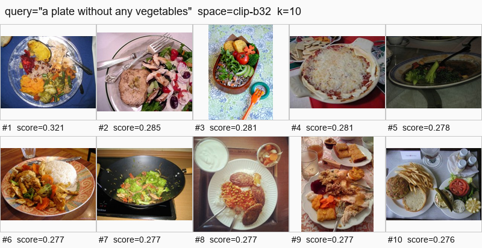

Đúng ý: **2/10** (`figures/bad_negation_no_vegetables.json`) — chỉ rank 4
(pizza/cracker, category `['pizza', 'spoon']`, không có category rau nào) và
rank 10 (burger/fries/sandwich, category `['bottle', 'bowl', 'dining table',
'knife', 'sandwich', 'wine glass']`, không có category rau) thực sự không có
rau. Tám ảnh còn lại đều có category `broccoli`/`carrot` hoặc caption mô tả rõ
rau/salad. Cùng cơ chế hỏng như "no cars": "without any vegetables" bị đọc gần
như "a plate" + "vegetables", nên phần lớn top-10 lại chính là những đĩa có
nhiều rau nhất về mặt ngữ nghĩa thị giác.

## Nhóm 3 — Quan hệ không gian

### "a cup to the left of a laptop"

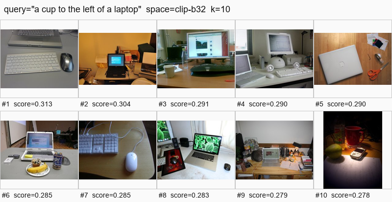

Đúng ý: **0/10** (`figures/bad_spatial_cup_left.json`). Chỉ 3/10 ảnh (rank 2,
3, 9) có cả `cup` và `laptop` trong category, nhưng không caption nào trong cả
3 ảnh đó mô tả vị trí trái/phải — nên không thể xác nhận đúng quan hệ không
gian được yêu cầu, và 7/10 còn lại còn thiếu hẳn một trong hai vật thể. CLIP
biểu diễn ảnh bằng một vector toàn cục duy nhất; không có cơ chế nào mã hoá toạ
độ tương đối giữa hai vật thể trong vector đó, nên cụm từ "to the left of" chỉ
đóng góp thêm nhiễu ngữ nghĩa (kiểu "bàn làm việc, đồ điện tử") chứ không lọc
được đúng bố cục.

### "a dog under a table"

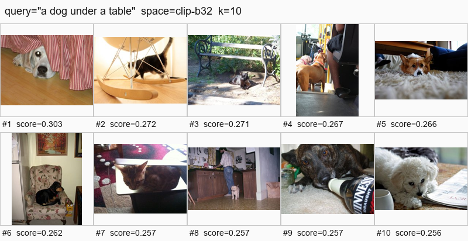

Đúng ý: **1/10** (`figures/bad_spatial_dog_under.json`) — chỉ rank 5 xác nhận
đúng qua caption: "A brown and white dog laying on a carpet under a table."
Rank 1 có chó nhưng ở dưới **giường** (bed), không phải bàn; rank 6 và 10 có
chó nhưng ở **trên** ghế/bàn (ngược hướng "under"); rank 2, 3, 7 không có chó
(có mèo). Mô hình nắm được cụm danh từ "dog" + "table" nhưng giới từ quan hệ
không gian ("under" vs "on" vs không liên quan) gần như không ảnh hưởng tới
vector — đúng như dự đoán ở §6.2 của spec thiết kế.

## Nhóm 4 — Thuộc tính mịn / chữ trong ảnh

### "a red sign that says STOP"

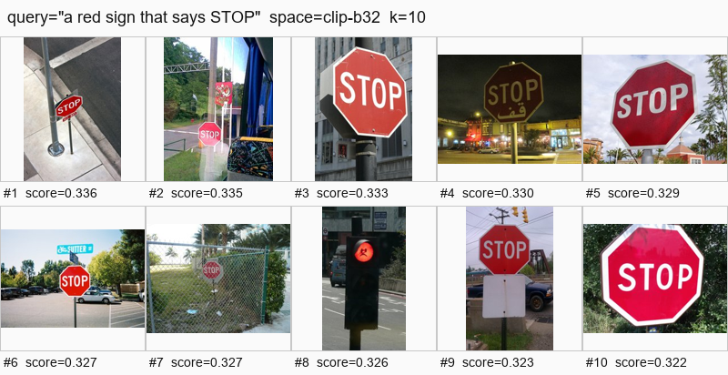

Đúng ý: **9/10** (`figures/bad_ocr_stop_sign.json`) — mọi rank trừ rank 8 đều
có category `stop sign` thật. Đây là kết quả tốt bất ngờ trong nhóm lỗi, nhưng
**không phải vì mô hình đọc được chữ "STOP"**: CLIP không có khả năng OCR đáng
tin cậy ở độ phân giải patch 32; nó nhận diện đúng vì biển stop có hình bát
giác đỏ đặc trưng — một đặc điểm thị giác mạnh mà CLIP học được từ hàng ngàn
ảnh biển báo giao thông khi huấn luyện, trùng khớp ngẫu nhiên với category
`stop sign` của COCO. Rank 8 là ca sai duy nhất: đó là đèn giao thông đỏ
(`traffic light`), không có biển báo — bị nhầm vì cùng tông đỏ và ngữ cảnh
giao thông.

### "a man in a striped blue shirt"

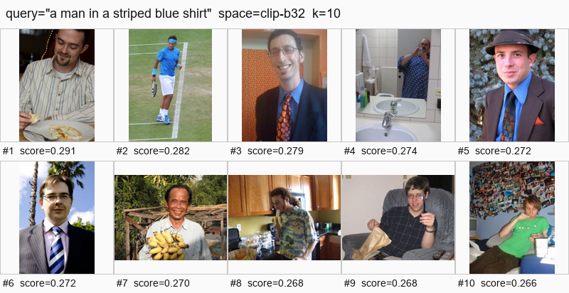

Đúng ý: **0/10** (`figures/bad_attr_striped_shirt.json`). Không ảnh nào có
caption xác nhận đồng thời cả ba thuộc tính "sọc" + "xanh dương" + "áo sơ mi".
Rank 4 có "blue shirt" nhưng không sọc; rank 6 có "striped suit" và "striped
blue and white tie" nhưng đó là sọc trên **cà vạt/vest**, không phải áo sơ mi;
rank 8 có áo hoa văn nhiệt đới ("Hawaiian shirt") nhưng không sọc và không
xanh dương. Đây là lỗi hợp thành thuộc tính (attribute binding): CLIP nắm
riêng lẻ được "man", "blue", "striped" nhưng không buộc được ba thuộc tính đó
phải cùng gắn vào đúng một vật thể (cái áo) — nó chỉ cộng dồn các tín hiệu rời
rạc vào một vector duy nhất.

## Nhóm 5 — Tổ hợp hiếm

### "a person riding a zebra"

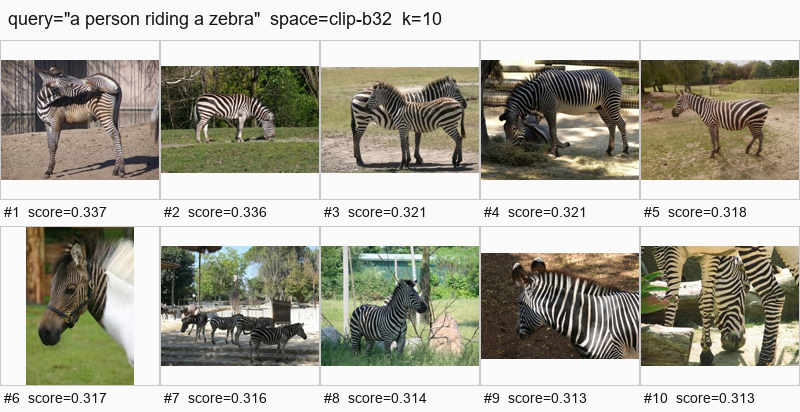

Đúng ý: **0/10** (`figures/bad_rare_riding_zebra.json`). Chín ảnh chỉ có ngựa
vằn (zebra) đơn lẻ, không có người; rank 7 có người nhưng caption ghi rõ họ
đang "viewing" (đứng xem) chứ không cưỡi. Ngựa vằn hoang dã không được thuần
hoá để cưỡi nên COCO gần như chắc chắn không có ảnh nào khớp thật — đây là một
tổ hợp không tồn tại trong phân bố huấn luyện lẫn trong tập dữ liệu truy hồi.
Mô hình xử lý bằng cách bỏ qua động từ "riding" và trả về ảnh gần nhất theo
danh từ nổi bật nhất trong câu ("zebra"), một hành vi giống "bag-of-concepts"
hơn là hiểu quan hệ hành động.

### "a cat wearing sunglasses"

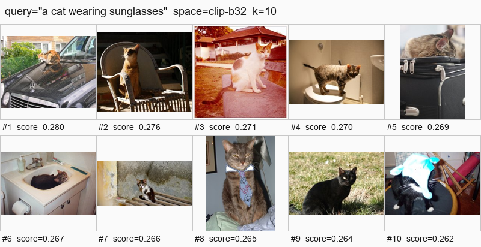

Đúng ý: **0/10** (`figures/bad_rare_cat_sunglasses.json`). Không ảnh nào có
kính râm. Thú vị là hai ảnh gần nhất về mặt cấu trúc câu là rank 8 ("wearing a
tie") và rank 10 ("wearing an elephant hat") — mô hình tìm đúng mẫu cú pháp
"cat + wearing + [phụ kiện]" nhưng vì "cat wearing sunglasses" không có ảnh
thật nào tương ứng trong 5.000 ảnh, nó trả về những ảnh "mèo + phụ kiện" gần
nhất sẵn có thay vì báo không tìm thấy. Cùng cơ chế thất bại như "riding a
zebra": tổ hợp hiếm không tồn tại trong corpus buộc hệ thống xấp xỉ bằng khái
niệm lân cận.

---

## Đối chiếu: 4 query tốt

### "a man riding a horse on the beach"

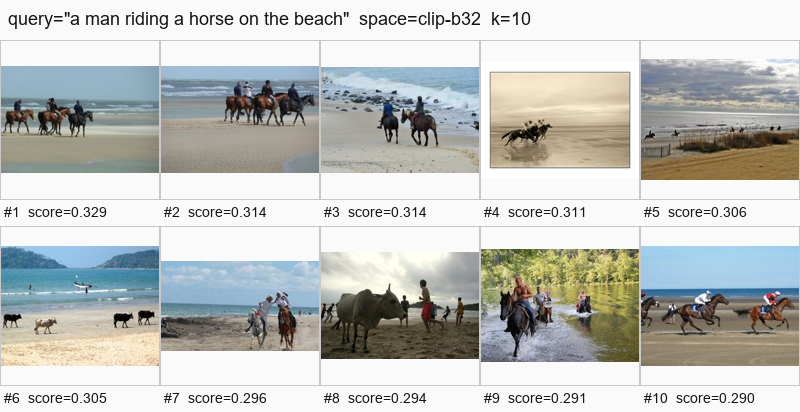

Đúng ý: **8/10** (`figures/good_horse_beach.json`). Tám ảnh đều có người cưỡi
ngựa trên bãi biển hoặc gần nước biển (kể cả số nhiều — "four people",
"jockeys" — vẫn đúng cấu trúc ngữ nghĩa chính). Hai ảnh sai (rank 6, 8) đều là
bò (`cow`) đi trên bãi biển, không phải ngựa — lỗi hợp lý vì cấu trúc cảnh
("động vật lớn đi trên cát cạnh nước, có người") rất giống nhau về mặt thị
giác toàn cục dù danh từ chính khác nhau.

### "a plate of pizza on a wooden table"

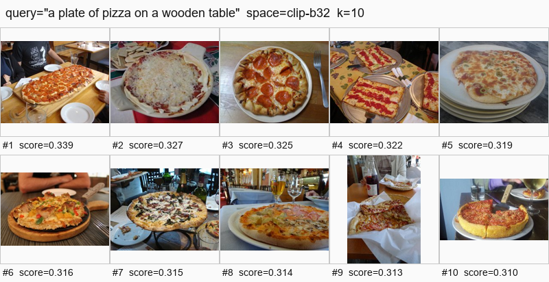

Đúng ý: **3/10** (`figures/good_pizza_table.json`) — chỉ rank 1, 5, 9 có
caption xác nhận rõ ràng "wooden table"/"wood background". Bảy ảnh còn lại đều
đúng phần lõi (pizza trên một mặt bàn/đĩa nào đó) nhưng không caption nào xác
nhận chất liệu gỗ (rank 8 thậm chí mô tả rõ bàn màu xanh — chắc chắn sai chất
liệu). Đây là ví dụ cho thấy ngay cả một query "dễ" cũng lộ ra cùng một điểm
yếu như nhóm thuộc tính mịn: mô hình khớp đúng danh từ chính (pizza, table)
rất tốt nhưng thuộc tính vật liệu phụ ("wooden") không được đảm bảo — khác
biệt với nhóm lỗi là ở đây danh từ chính đúng 10/10 nên trải nghiệm tìm kiếm
vẫn hữu ích, chỉ là con số "đúng ý tuyệt đối" bị kéo xuống bởi một thuộc tính
phụ ít được caption nhắc tới.

### "a double decker bus on a city street"

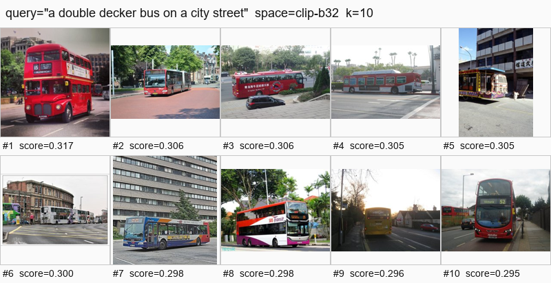

Đúng ý: **4/10** (`figures/good_bus_street.json`) — rank 1, 6, 8, 10 có
caption xác nhận rõ "double decker bus" trên đường phố. Đáng chú ý rank 2 là
một ca gây nhiễu từ vựng: caption gọi nó là "a double bus" nhưng mô tả chi
tiết lại là xe buýt khớp nối (articulated/bendy bus, một khoang), khác hẳn xe
buýt hai tầng (double-decker) — cho thấy việc chỉ khớp từ "double" không đủ
để phân biệt hai loại xe buýt hoàn toàn khác nhau về hình dạng.

### "skiers on a snowy mountain slope"

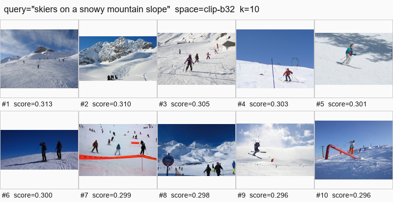

Đúng ý: **8/10** (`figures/good_skiers_snow.json`). Tám ảnh đầu đều có nhóm
người trượt tuyết trên dốc núi phủ tuyết, khớp gần như trọn vẹn ý query. Hai
ảnh cuối (rank 9, 10) lệch dần khỏi "mountain slope" điển hình — rank 9 là một
người được kéo dây (giống dù lượn trên tuyết hơn là trượt dốc), rank 10 là một
pha trượt trên thanh ray kim loại (tính năng công viên trượt tuyết, không phải
sườn núi). Đây là query "dễ" nhất trong toàn bộ 14 query vì cụm danh từ
("skiers", "snow", "mountain/slope") đều là các khái niệm thị giác rõ ràng,
tần suất cao trong dữ liệu huấn luyện.

---

## Tổng kết theo 5 nhóm lỗi

| # | Nhóm lỗi | Query 1 (đúng ý/10) | Query 2 (đúng ý/10) | Trung bình |
|---|---|---|---|---|
| 1 | Đếm số lượng | three dogs: 2 | exactly two people sitting: 2 | **2.0/10** |
| 2 | Phủ định | a street with no cars: 0 | a plate without any vegetables: 2 | **1.0/10** |
| 3 | Quan hệ không gian | a cup to the left of a laptop: 0 | a dog under a table: 1 | **0.5/10** |
| 4 | Thuộc tính mịn / chữ trong ảnh | a red sign that says STOP: 9 | a man in a striped blue shirt: 0 | **4.5/10** |
| 5 | Tổ hợp hiếm | a person riding a zebra: 0 | a cat wearing sunglasses: 0 | **0.0/10** |

Đối chiếu — 4 query tốt: horse/beach 8, pizza/table 3, bus/street 4,
skiers/snow 8 → trung bình **5.75/10**.

**Nhận định.** Xét thuần theo con số, nhóm **Tổ hợp hiếm** hỏng nặng nhất
(0.0/10 tuyệt đối — không một kết quả nào đúng ý ở cả hai query), vì đơn giản
là những tổ hợp này gần như không tồn tại ảnh thật tương ứng trong 5.000 ảnh
COCO, nên không có "đáp án đúng" nào để mô hình tìm ra dù có hoàn hảo tới đâu.
Nếu tính theo "nhóm mà mô hình lẽ ra phải làm được nhưng vẫn hỏng", nhóm
**Quan hệ không gian** đáng lo hơn (0.5/10) vì các vật thể liên quan (cốc,
laptop, chó, bàn) đều có sẵn và đơn lẻ trong corpus — cái hỏng không phải do
thiếu ảnh mà do CLIP không mã hoá quan hệ không gian trong vector toàn cục,
đây là giới hạn kiến trúc thật sự. Điểm trung bình 4.5/10 của nhóm 4 gây hiểu
lầm nếu đọc vội: nó cao hoàn toàn nhờ "STOP sign" ăn may qua nhận diện hình
dạng biển báo (không phải OCR thật), trong khi truy vấn thuộc tính hợp thành
("striped blue shirt") vẫn hỏng tuyệt đối (0/10) — cùng bản chất thất bại với
nhóm thuộc tính phụ ở chính các query "tốt" (vd "wooden table" chỉ xác nhận
được ở 3/10). Nhóm **Phủ định** và **Đếm số lượng** hỏng theo đúng dự đoán của
spec thiết kế (§7.3): đây là giới hạn đã biết của contrastive learning, không
phải lỗi cài đặt — cả hai đều liên quan tới việc mô hình không có cơ chế phủ
định hoá hay đếm rời rạc trong không gian vector liên tục.
